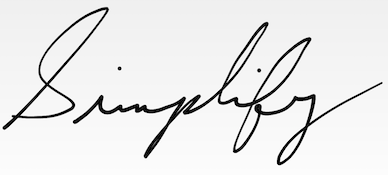

Ink
===

A light-weight, customizable view for capturing a signature or drawing in an Android app.

Download
--------

You can download the latest version of the the binary here:

    http://dl.bintray.com/simplify/Android/com/simplify/ink/0.2.1/ink-0.2.1.aar

or via Maven:

    <dependency>
        <groupId>com.simplify</groupId>
        <artifactId>ink</artifactId>
        <version>0.2.1</version>
        <type>aar</type>
    </dependency>

or via Gradle:

    compile group: 'com.simplify', name: 'ink', version: '0.2.1', ext: 'aar'

Usage
-----

To use the library, you must include the InkView class in your project. A simple solution is to reference it directly into your layout:

    <com.simplify.ink.InkView
            android:id="@+id/ink"
            android:layout_width="match_parent"
            android:layout_height="match_parent"/>

Then, within your code, fetch the view and initialize it:

    InkView ink = (InkView) findViewById(R.id.ink);
    ink.setColor(getResources().getColor(android.R.color.black));
    ink.setMinStrokeWidth(1.5f);
    ink.setMaxStrokeWidth(6f);

Features can be toggled on and off by using the custom attributes on the xml tag:

    // add this to the root element in your layout
    xmlns:app="http://schemas.android.com/apk/res-auto"

    <com.simplify.ink.InkView
                android:id="@+id/ink"
                android:layout_width="match_parent"
                android:layout_height="match_parent"
                app:inkFlags="interpolation|responsiveWeight"/>

or by setting the flags manually in code:

    InkView ink = (InkView) findViewById(R.id.ink);
    ink.setFlags(InkView.FLAG_INTERPOLATION | InkView.FLAG_RESPONSIVE_WEIGHT);

By default, interpolation and responsive weight flags are On.

You can capture the drawing in the form of a bitmap by calling:

    Bitmap drawing = ink.getBitmap();

or you can also include a background color:

    Bitmap drawing = ink.getBitmap(getResources().getColor(R.color.my_background_color));

Troubleshooting
---------------

If things don't look quite right (not all touch screens are created equal), then there is a debug flag that is helpful in diagnosing problems. The sample app includes a toggle for this flag which draws the data points and their respective control points.

For troubleshooting inquiries, please include device information and a screenshot of the problem with the debug flag on, if relevant.

Enjoy!